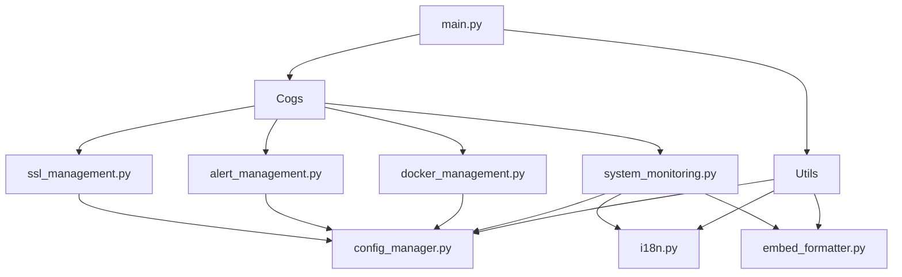

# Development Guide

Languages: [English](development.md) | [繁體中文](zh-tw/development.md) | [简体中文](zh-cn/development.md)

This guide provides comprehensive information for developers who want to contribute to Logivore, understand its codebase, and follow development best practices.

## Table of Contents

- [Development Environment Setup](#development-environment-setup)
- [Project Structure](#project-structure)
- [Development Workflow](#development-workflow)
- [Code Style and Standards](#code-style-and-standards)
- [Testing Framework](#testing-framework)
- [Architecture Patterns](#architecture-patterns)
- [Contributing Guidelines](#contributing-guidelines)
- [Release Process](#release-process)
- [Development Tools](#development-tools)
- [Debugging and Profiling](#debugging-and-profiling)

## Development Environment Setup

### Prerequisites

- Python 3.8 or higher
- Git
- Docker (optional, for testing)
- Virtual environment tool (venv, virtualenv, or conda)

### Initial Setup

```bash
# 1. Clone the repository
git clone https://github.com/kaiyasi/Logivore.git
cd Logivore

# 2. Create and activate virtual environment
python -m venv venv
source venv/bin/activate  # Linux/Mac
# or
venv\Scripts\activate  # Windows

# 3. Install development dependencies
pip install --upgrade pip setuptools wheel
pip install -r requirements.txt
pip install -r requirements-dev.txt

# 4. Install pre-commit hooks
pre-commit install

# 5. Set up configuration
cp .env.example .env
cp config/bot_config.example.json config/bot_config.json

# 6. Edit configuration with your development settings
nano .env
nano config/bot_config.json

# 7. Create necessary directories
mkdir -p logs data/backups
```

### Development Dependencies

```text
# requirements-dev.txt
pytest>=6.0.0
pytest-asyncio>=0.18.0
pytest-cov>=3.0.0
black>=22.0.0
flake8>=4.0.0
mypy>=0.950
pre-commit>=2.17.0
isort>=5.10.0
sphinx>=4.5.0
sphinx-rtd-theme>=1.0.0
bandit>=1.7.4
safety>=2.0.0
coverage>=6.3.0
```

### IDE Configuration

#### VS Code Settings

```json
// .vscode/settings.json
{
    "python.defaultInterpreterPath": "./venv/bin/python",
    "python.linting.enabled": true,
    "python.linting.pylintEnabled": false,
    "python.linting.flake8Enabled": true,
    "python.linting.mypyEnabled": true,
    "python.formatting.provider": "black",
    "python.formatting.blackArgs": ["--line-length", "100"],
    "python.sortImports.args": ["--profile", "black"],
    "editor.formatOnSave": true,
    "editor.codeActionsOnSave": {
        "source.organizeImports": true
    },
    "files.exclude": {
        "**/__pycache__": true,
        "**/*.pyc": true,
        ".pytest_cache": true,
        ".coverage": true,
        "venv/": true
    }
}
```

#### PyCharm Configuration

1. **Interpreter**: Point to `venv/bin/python`
2. **Code Style**: Set line length to 100
3. **Inspections**: Enable type checking and PEP 8
4. **File Watchers**: Set up for Black and isort

## Project Structure

### Directory Layout

```
Logivore/
├── main.py                    # Bot entry point
├── requirements.txt           # Production dependencies
├── requirements-dev.txt       # Development dependencies
├── .env.example              # Environment template
├── .gitignore                # Git ignore rules
├── .pre-commit-config.yaml   # Pre-commit hooks
├── setup.py                  # Package configuration
├── pytest.ini               # Pytest configuration
├── mypy.ini                  # MyPy configuration
├── README.md                 # Project overview
├── LICENSE                   # MIT license
├── CONTRIBUTING.md           # Contribution guidelines
├── CHANGELOG.md              # Version history
│
├── config/                   # Configuration files
│   ├── bot_config.json       # Main configuration
│   ├── bot_config.example.json
│   └── logging.conf          # Logging configuration
│
├── cogs/                     # Discord.py cogs (features)
│   ├── __init__.py
│   ├── system_monitoring.py  # System monitoring commands
│   ├── docker_management.py  # Docker container management
│   ├── alert_management.py   # Alert system
│   ├── ssl_management.py     # SSL certificate management
│   ├── configuration.py      # Configuration commands
│   ├── bot_management.py     # Bot administration
│   └── help_system.py        # Help and documentation
│
├── utils/                    # Utility modules
│   ├── __init__.py
│   ├── config_manager.py     # Configuration management
│   ├── i18n.py              # Internationalization
│   ├── embed_formatter.py   # Discord embed formatting
│   ├── database.py          # Database operations
│   ├── logger.py            # Logging utilities
│   └── decorators.py        # Custom decorators
│
├── languages/               # Internationalization files
│   ├── en.json              # English
│   ├── zh-tw.json           # Traditional Chinese
│   ├── zh-cn.json           # Simplified Chinese
│   ├── ko.json              # Korean
│   ├── ja.json              # Japanese
│   ├── de.json              # German
│   └── ru.json              # Russian
│
├── tests/                   # Test suite
│   ├── __init__.py
│   ├── conftest.py          # Pytest configuration
│   ├── test_cogs/           # Cog tests
│   ├── test_utils/          # Utility tests
│   └── fixtures/            # Test fixtures
│
├── docs/                    # Documentation
│   ├── installation.md
│   ├── configuration.md
│   ├── commands.md
│   ├── api.md
│   ├── customization.md
│   ├── troubleshooting.md
│   └── development.md
│
├── scripts/                 # Development scripts
│   ├── setup_dev.sh         # Development setup
│   ├── run_tests.sh         # Test runner
│   ├── check_code.sh        # Code quality checks
│   └── deploy.sh            # Deployment script
│
├── logs/                    # Log files
│   └── .gitkeep
│
├── data/                    # Data storage
│   ├── database.db          # SQLite database
│   └── backups/             # Configuration backups
│
└── .github/                 # GitHub workflows
    ├── workflows/
    │   ├── ci.yml           # Continuous integration
    │   ├── release.yml      # Release automation
    │   └── docs.yml         # Documentation build
    ├── ISSUE_TEMPLATE/      # Issue templates
    └── PULL_REQUEST_TEMPLATE.md
```

### Module Relationships



## Development Workflow

### Git Workflow

We use the **Git Flow** branching model:

```bash
# Main branches
main        # Production-ready code
develop     # Integration branch for features

# Supporting branches
feature/*   # New features
hotfix/*    # Critical bug fixes
release/*   # Release preparation
```

### Feature Development

```bash
# 1. Create feature branch from develop
git checkout develop
git pull origin develop
git checkout -b feature/new-monitoring-feature

# 2. Develop and commit changes
git add .
git commit -m "feat: add custom metrics monitoring"

# 3. Push feature branch
git push origin feature/new-monitoring-feature

# 4. Create pull request to develop branch
# 5. After review and approval, merge via GitHub
```

### Commit Message Convention

We follow the [Conventional Commits](https://www.conventionalcommits.org/) specification:

```bash
# Format
<type>[optional scope]: <description>

[optional body]

[optional footer(s)]

# Types
feat:     # New feature
fix:      # Bug fix
docs:     # Documentation changes
style:    # Code style changes (formatting, etc.)
refactor: # Code refactoring
perf:     # Performance improvements
test:     # Adding or updating tests
chore:    # Maintenance tasks
ci:       # CI/CD changes

# Examples
feat(monitoring): add GPU temperature monitoring
fix(docker): resolve container restart issue
docs: update installation guide
test(utils): add tests for config manager
```

### Development Cycle

1. **Plan**: Create GitHub issue for feature/bug
2. **Develop**: Create feature branch and implement
3. **Test**: Write and run tests
4. **Review**: Create pull request and get code review
5. **Integrate**: Merge to develop branch
6. **Release**: Create release branch and deploy

## Code Style and Standards

### Python Style Guide

We follow **PEP 8** with some modifications:

```python
# Line length: 100 characters (instead of 79)
# String quotes: Double quotes preferred
# Import order: isort with black profile

# Example of good style:
import os
from typing import Dict, List, Optional

import discord
from discord.ext import commands

from utils.config_manager import ConfigManager
from utils.embed_formatter import EmbedFormatter


class ExampleCog(commands.Cog):
    """Example cog following code style standards."""

    def __init__(self, bot: commands.Bot) -> None:
        self.bot = bot
        self.config: ConfigManager = bot.config_manager

    async def example_method(self, parameter: str) -> Optional[Dict[str, str]]:
        """
        Example method with proper type hints and docstring.

        Args:
            parameter: Description of the parameter

        Returns:
            Optional dictionary with string keys and values

        Raises:
            ValueError: If parameter is invalid
        """
        if not parameter:
            raise ValueError("Parameter cannot be empty")

        return {"result": parameter.upper()}
```

### Type Hints

All new code must include type hints:

```python
from typing import Any, Dict, List, Optional, Union

# Function signatures
async def process_data(
    data: List[Dict[str, Any]],
    config: Dict[str, str],
    timeout: Optional[float] = None
) -> Union[str, None]:
    """Process data with configuration."""
    pass

# Class attributes
class DataProcessor:
    def __init__(self) -> None:
        self.cache: Dict[str, Any] = {}
        self.enabled: bool = True
        self.timeout: Optional[float] = None
```

### Documentation Standards

#### Docstring Format (Google Style)

```python
def complex_function(
    param1: str,
    param2: int,
    param3: Optional[bool] = None
) -> Dict[str, Any]:
    """
    Brief description of the function.

    Longer description explaining the function's purpose,
    behavior, and any important details.

    Args:
        param1: Description of the first parameter.
        param2: Description of the second parameter.
        param3: Optional parameter with default value.

    Returns:
        Dictionary containing the result data with string keys.

    Raises:
        ValueError: If param1 is empty.
        ConnectionError: If unable to connect to external service.

    Example:
        >>> result = complex_function("test", 42, True)
        >>> print(result["status"])
        "success"
    """
    pass
```

#### Code Comments

```python
# Good comments explain WHY, not WHAT
def calculate_disk_usage(path: str) -> float:
    """Calculate disk usage percentage for given path."""
    # Use statvfs for accurate filesystem statistics (Linux/Unix)
    # instead of walking directory tree which is slower
    stat = os.statvfs(path)

    # Calculate percentage: (used blocks / total blocks) * 100
    total_blocks = stat.f_blocks
    free_blocks = stat.f_bavail
    used_blocks = total_blocks - free_blocks

    return (used_blocks / total_blocks) * 100 if total_blocks > 0 else 0.0
```

### Error Handling

```python
import logging
from typing import Optional

logger = logging.getLogger(__name__)


class CustomError(Exception):
    """Custom exception for specific error cases."""
    pass


async def robust_function(data: str) -> Optional[str]:
    """Example of proper error handling."""
    try:
        # Main operation
        result = await process_data(data)
        return result

    except ValueError as e:
        # Handle expected errors gracefully
        logger.warning(f"Invalid data format: {e}")
        return None

    except ConnectionError as e:
        # Handle network errors with retry logic
        logger.error(f"Connection failed: {e}")
        raise CustomError(f"Unable to process request: {e}") from e

    except Exception as e:
        # Log unexpected errors with full context
        logger.exception(f"Unexpected error in robust_function: {e}")
        raise

    finally:
        # Cleanup resources
        await cleanup_resources()
```

## Testing Framework

### Test Structure

```python
# tests/test_cogs/test_system_monitoring.py
import pytest
from unittest.mock import AsyncMock, MagicMock, patch

import discord
from discord.ext import commands

from cogs.system_monitoring import SystemMonitoringCog
from utils.config_manager import ConfigManager


class TestSystemMonitoringCog:
    """Test suite for SystemMonitoringCog."""

    @pytest.fixture
    async def bot(self):
        """Create a test bot instance."""
        bot = MagicMock(spec=commands.Bot)
        bot.config_manager = MagicMock(spec=ConfigManager)
        bot.i18n = MagicMock()
        return bot

    @pytest.fixture
    async def cog(self, bot):
        """Create a SystemMonitoringCog instance."""
        return SystemMonitoringCog(bot)

    @pytest.fixture
    def mock_interaction(self):
        """Create a mock Discord interaction."""
        interaction = AsyncMock(spec=discord.Interaction)
        interaction.guild_id = 12345
        interaction.user.id = 67890
        interaction.response = AsyncMock()
        interaction.followup = AsyncMock()
        return interaction

    @pytest.mark.asyncio
    async def test_monitor_command_success(self, cog, mock_interaction):
        """Test successful monitor command execution."""
        with patch('psutil.cpu_percent', return_value=45.2), \
             patch('psutil.virtual_memory') as mock_memory, \
             patch('psutil.disk_usage') as mock_disk:

            # Setup mocks
            mock_memory.return_value.percent = 67.8
            mock_disk.return_value.percent = 23.1

            # Execute command
            await cog.monitor(mock_interaction)

            # Verify interaction was called
            mock_interaction.response.send_message.assert_called_once()

            # Get the embed from the call
            call_args = mock_interaction.response.send_message.call_args
            embed = call_args.kwargs.get('embed')

            assert embed is not None
            assert "System Monitor" in embed.title

    @pytest.mark.asyncio
    async def test_monitor_command_permission_error(self, cog, mock_interaction):
        """Test monitor command with permission error."""
        with patch('psutil.cpu_percent', side_effect=PermissionError("Access denied")):
            await cog.monitor(mock_interaction)

            # Should handle error gracefully
            mock_interaction.response.send_message.assert_called_once()

    @pytest.mark.asyncio
    async def test_monitor_command_with_custom_language(self, cog, mock_interaction):
        """Test monitor command with custom language setting."""
        # Setup custom language
        cog.config.get.return_value = 'ja'  # Japanese

        with patch('psutil.cpu_percent', return_value=50.0):
            await cog.monitor(mock_interaction)

            # Verify language was used
            cog.i18n.get.assert_called()
```

### Running Tests

```bash
# Run all tests
pytest

# Run with coverage
pytest --cov=cogs --cov=utils --cov-report=html

# Run specific test file
pytest tests/test_cogs/test_system_monitoring.py

# Run with verbose output
pytest -v

# Run only failed tests
pytest --lf

# Run tests matching pattern
pytest -k "test_monitor"

# Run tests with specific markers
pytest -m "slow"
```

### Test Configuration

```ini
# pytest.ini
[tool:pytest]
testpaths = tests
python_files = test_*.py
python_classes = Test*
python_functions = test_*
addopts =
    --strict-markers
    --strict-config
    --verbose
    --tb=short
    --cov=cogs
    --cov=utils
    --cov-branch
    --cov-report=term-missing
    --cov-report=html:htmlcov
    --cov-fail-under=80
markers =
    slow: marks tests as slow (deselect with '-m "not slow"')
    integration: marks tests as integration tests
    unit: marks tests as unit tests
asyncio_mode = auto
```

## Architecture Patterns

### Dependency Injection

```python
# utils/container.py
from typing import Any, Dict, Type, TypeVar

T = TypeVar('T')


class DIContainer:
    """Simple dependency injection container."""

    def __init__(self) -> None:
        self._services: Dict[str, Any] = {}
        self._factories: Dict[str, callable] = {}

    def register(self, service_type: Type[T], instance: T) -> None:
        """Register a service instance."""
        self._services[service_type.__name__] = instance

    def register_factory(self, service_type: Type[T], factory: callable) -> None:
        """Register a service factory."""
        self._factories[service_type.__name__] = factory

    def get(self, service_type: Type[T]) -> T:
        """Get a service instance."""
        service_name = service_type.__name__

        if service_name in self._services:
            return self._services[service_name]

        if service_name in self._factories:
            instance = self._factories[service_name]()
            self._services[service_name] = instance
            return instance

        raise ValueError(f"Service {service_name} not registered")


# Usage in main.py
container = DIContainer()
container.register(ConfigManager, ConfigManager('config/bot_config.json'))
container.register(I18n, I18n())

# In cogs
class SystemMonitoringCog(commands.Cog):
    def __init__(self, bot: commands.Bot, container: DIContainer) -> None:
        self.bot = bot
        self.config = container.get(ConfigManager)
        self.i18n = container.get(I18n)
```

### Event System

```python
# utils/events.py
from typing import Any, Callable, Dict, List
import asyncio


class EventBus:
    """Event bus for loosely coupled communication."""

    def __init__(self) -> None:
        self._subscribers: Dict[str, List[Callable]] = {}

    def subscribe(self, event_name: str, handler: Callable) -> None:
        """Subscribe to an event."""
        if event_name not in self._subscribers:
            self._subscribers[event_name] = []
        self._subscribers[event_name].append(handler)

    def unsubscribe(self, event_name: str, handler: Callable) -> None:
        """Unsubscribe from an event."""
        if event_name in self._subscribers:
            self._subscribers[event_name].remove(handler)

    async def publish(self, event_name: str, **kwargs: Any) -> None:
        """Publish an event to all subscribers."""
        if event_name not in self._subscribers:
            return

        tasks = []
        for handler in self._subscribers[event_name]:
            if asyncio.iscoroutinefunction(handler):
                tasks.append(handler(**kwargs))
            else:
                # Run sync handlers in thread pool
                loop = asyncio.get_event_loop()
                tasks.append(loop.run_in_executor(None, handler, **kwargs))

        if tasks:
            await asyncio.gather(*tasks, return_exceptions=True)


# Usage
event_bus = EventBus()

# Subscribe to events
@event_bus.subscribe('system_alert')
async def handle_system_alert(alert_type: str, message: str, **kwargs):
    """Handle system alert events."""
    logging.warning(f"System alert: {alert_type} - {message}")

# Publish events
await event_bus.publish(
    'system_alert',
    alert_type='cpu_high',
    message='CPU usage above 90%',
    current_usage=95.2
)
```

### Command Pattern

```python
# utils/commands.py
from abc import ABC, abstractmethod
from typing import Any, Dict


class Command(ABC):
    """Base command interface."""

    @abstractmethod
    async def execute(self, **kwargs: Any) -> Any:
        """Execute the command."""
        pass

    @abstractmethod
    async def undo(self) -> None:
        """Undo the command if possible."""
        pass


class RestartContainerCommand(Command):
    """Command to restart a Docker container."""

    def __init__(self, container_name: str, docker_manager) -> None:
        self.container_name = container_name
        self.docker_manager = docker_manager
        self.previous_state: Optional[str] = None

    async def execute(self, **kwargs: Any) -> bool:
        """Restart the container."""
        # Store previous state for undo
        container = await self.docker_manager.get_container(self.container_name)
        self.previous_state = container.status

        # Execute restart
        return await self.docker_manager.restart_container(self.container_name)

    async def undo(self) -> None:
        """Restore previous container state."""
        if self.previous_state == 'stopped':
            await self.docker_manager.stop_container(self.container_name)


class CommandInvoker:
    """Invoke and manage commands."""

    def __init__(self) -> None:
        self.history: List[Command] = []

    async def execute_command(self, command: Command, **kwargs: Any) -> Any:
        """Execute a command and add to history."""
        result = await command.execute(**kwargs)
        self.history.append(command)
        return result

    async def undo_last_command(self) -> None:
        """Undo the last executed command."""
        if self.history:
            command = self.history.pop()
            await command.undo()
```

## Contributing Guidelines

### Code Review Process

1. **Pull Request Requirements**:
   - Clear description of changes
   - Tests for new functionality
   - Updated documentation
   - Passing CI checks

2. **Review Checklist**:
   - [ ] Code follows style guidelines
   - [ ] Type hints are present
   - [ ] Tests are comprehensive
   - [ ] Documentation is updated
   - [ ] No security vulnerabilities
   - [ ] Performance impact is acceptable

3. **Review Timeline**:
   - Initial review within 2 business days
   - Address feedback within 1 week
   - Final approval and merge

### Security Guidelines

```python
# Security best practices

# 1. Input validation
def validate_container_name(name: str) -> str:
    """Validate container name to prevent injection attacks."""
    import re

    if not re.match(r'^[a-zA-Z0-9][a-zA-Z0-9_.-]*$', name):
        raise ValueError("Invalid container name format")

    if len(name) > 255:
        raise ValueError("Container name too long")

    return name

# 2. Secure configuration handling
class SecureConfig:
    """Handle sensitive configuration securely."""

    def __init__(self) -> None:
        self._secrets: Dict[str, str] = {}

    def set_secret(self, key: str, value: str) -> None:
        """Store secret securely."""
        # In production, use proper secret management
        self._secrets[key] = value

    def get_secret(self, key: str) -> Optional[str]:
        """Retrieve secret securely."""
        return self._secrets.get(key)

    def __repr__(self) -> str:
        """Prevent accidental secret exposure."""
        return f"SecureConfig(keys={list(self._secrets.keys())})"

# 3. Command injection prevention
async def safe_execute_command(command: List[str]) -> str:
    """Execute system command safely."""
    import shlex
    import subprocess

    # Use list form to prevent shell injection
    result = await asyncio.create_subprocess_exec(
        *command,
        stdout=subprocess.PIPE,
        stderr=subprocess.PIPE
    )

    stdout, stderr = await result.communicate()

    if result.returncode != 0:
        raise subprocess.CalledProcessError(result.returncode, command, stderr)

    return stdout.decode()
```

### Performance Guidelines

```python
# Performance best practices

# 1. Async/await usage
async def efficient_data_collection() -> Dict[str, Any]:
    """Collect data efficiently using async operations."""

    # Bad: Sequential operations
    # cpu_data = await get_cpu_data()
    # memory_data = await get_memory_data()
    # disk_data = await get_disk_data()

    # Good: Concurrent operations
    cpu_task = asyncio.create_task(get_cpu_data())
    memory_task = asyncio.create_task(get_memory_data())
    disk_task = asyncio.create_task(get_disk_data())

    cpu_data, memory_data, disk_data = await asyncio.gather(
        cpu_task, memory_task, disk_task
    )

    return {
        'cpu': cpu_data,
        'memory': memory_data,
        'disk': disk_data
    }

# 2. Caching
from functools import lru_cache
from time import time

class CachedDataCollector:
    """Data collector with caching."""

    def __init__(self, cache_timeout: int = 60) -> None:
        self.cache_timeout = cache_timeout
        self._cache: Dict[str, tuple] = {}

    async def get_cached_data(self, key: str, data_func: Callable) -> Any:
        """Get data with caching."""
        current_time = time()

        if key in self._cache:
            data, timestamp = self._cache[key]
            if current_time - timestamp < self.cache_timeout:
                return data

        # Cache miss or expired
        data = await data_func()
        self._cache[key] = (data, current_time)
        return data

# 3. Memory management
import weakref

class MemoryEfficientManager:
    """Manager with efficient memory usage."""

    def __init__(self) -> None:
        # Use weak references to avoid memory leaks
        self._observers: weakref.WeakSet = weakref.WeakSet()

        # Limit collection sizes
        self._recent_data: deque = deque(maxlen=100)

    def add_observer(self, observer: Any) -> None:
        """Add observer with weak reference."""
        self._observers.add(observer)

    def cleanup_old_data(self) -> None:
        """Periodically clean up old data."""
        # Keep only recent data
        cutoff_time = time() - 3600  # 1 hour
        self._recent_data = deque(
            (item for item in self._recent_data if item.timestamp > cutoff_time),
            maxlen=100
        )
```

## Release Process

### Version Management

We use [Semantic Versioning](https://semver.org/):

```
MAJOR.MINOR.PATCH

MAJOR: Breaking changes
MINOR: New features (backward compatible)
PATCH: Bug fixes (backward compatible)
```

### Release Workflow

```bash
# 1. Create release branch
git checkout develop
git pull origin develop
git checkout -b release/v1.2.0

# 2. Update version numbers
# Update setup.py, __init__.py, etc.

# 3. Update CHANGELOG.md
# Add release notes for v1.2.0

# 4. Commit changes
git add .
git commit -m "chore: prepare release v1.2.0"

# 5. Create pull request to main
# After approval and merge:

# 6. Create GitHub release
git checkout main
git pull origin main
git tag -a v1.2.0 -m "Release v1.2.0"
git push origin v1.2.0

# 7. Merge back to develop
git checkout develop
git merge main
git push origin develop
```

### Automated Release (GitHub Actions)

```yaml
# .github/workflows/release.yml
name: Release

on:
  push:
    tags:
      - 'v*'

jobs:
  release:
    runs-on: ubuntu-latest
    steps:
      - uses: actions/checkout@v3

      - name: Set up Python
        uses: actions/setup-python@v4
        with:
          python-version: '3.9'

      - name: Install dependencies
        run: |
          pip install build twine

      - name: Build package
        run: python -m build

      - name: Create GitHub Release
        uses: actions/create-release@v1
        env:
          GITHUB_TOKEN: ${{ secrets.GITHUB_TOKEN }}
        with:
          tag_name: ${{ github.ref }}
          release_name: Release ${{ github.ref }}
          draft: false
          prerelease: false

      - name: Build Docker image
        run: |
          docker build -t serelixbot:${{ github.ref_name }} .
          docker tag serelixbot:${{ github.ref_name }} serelixbot:latest
```

## Development Tools

### Pre-commit Hooks

```yaml
# .pre-commit-config.yaml
repos:
  - repo: https://github.com/pre-commit/pre-commit-hooks
    rev: v4.4.0
    hooks:
      - id: trailing-whitespace
      - id: end-of-file-fixer
      - id: check-yaml
      - id: check-added-large-files
      - id: check-merge-conflict

  - repo: https://github.com/psf/black
    rev: 22.10.0
    hooks:
      - id: black
        args: [--line-length=100]

  - repo: https://github.com/pycqa/isort
    rev: 5.10.1
    hooks:
      - id: isort
        args: [--profile=black]

  - repo: https://github.com/pycqa/flake8
    rev: 5.0.4
    hooks:
      - id: flake8
        args: [--max-line-length=100, --extend-ignore=E203,W503]

  - repo: https://github.com/pre-commit/mirrors-mypy
    rev: v0.991
    hooks:
      - id: mypy
        additional_dependencies: [types-all]

  - repo: https://github.com/pycqa/bandit
    rev: 1.7.4
    hooks:
      - id: bandit
        args: [-r, ., -x, tests/]
```

### Code Quality Scripts

```bash
#!/bin/bash
# scripts/check_code.sh

echo "🔍 Running code quality checks..."

echo "📝 Checking code formatting with Black..."
black --check --diff cogs/ utils/ tests/

echo "📋 Checking import order with isort..."
isort --check-only --diff cogs/ utils/ tests/

echo "🔎 Running linting with flake8..."
flake8 cogs/ utils/ tests/

echo "🔬 Running type checking with MyPy..."
mypy cogs/ utils/

echo "🛡️ Running security check with Bandit..."
bandit -r cogs/ utils/ -x tests/

echo "🧪 Running tests with coverage..."
pytest --cov=cogs --cov=utils --cov-report=term-missing

echo "✅ All checks completed!"
```

### Development Utilities

```python
# scripts/dev_utils.py
"""Development utilities and helpers."""

import asyncio
import sys
from pathlib import Path

# Add project root to path
project_root = Path(__file__).parent.parent
sys.path.insert(0, str(project_root))


async def test_bot_connection():
    """Test Discord bot connection."""
    from main import SerelixBot

    bot = SerelixBot()
    try:
        await bot.start(bot.config.get('bot.token'))
    except KeyboardInterrupt:
        await bot.close()
    except Exception as e:
        print(f"Connection test failed: {e}")


def generate_language_template():
    """Generate template for new language."""
    import json

    # Load English as template
    with open('languages/en.json', 'r') as f:
        template = json.load(f)

    # Create template with empty values
    def empty_template(obj):
        if isinstance(obj, dict):
            return {k: empty_template(v) for k, v in obj.items()}
        elif isinstance(obj, str):
            return ""
        else:
            return obj

    empty = empty_template(template)

    # Save template
    with open('languages/template.json', 'w') as f:
        json.dump(empty, f, indent=2)

    print("Language template generated: languages/template.json")


def count_lines_of_code():
    """Count lines of code in the project."""
    import os

    extensions = ['.py']
    exclude_dirs = ['venv', '__pycache__', '.git', 'node_modules']

    total_lines = 0
    total_files = 0

    for root, dirs, files in os.walk('.'):
        # Remove excluded directories
        dirs[:] = [d for d in dirs if d not in exclude_dirs]

        for file in files:
            if any(file.endswith(ext) for ext in extensions):
                file_path = os.path.join(root, file)
                try:
                    with open(file_path, 'r', encoding='utf-8') as f:
                        lines = len(f.readlines())
                        total_lines += lines
                        total_files += 1
                        print(f"{file_path}: {lines} lines")
                except Exception:
                    pass

    print(f"\nTotal: {total_files} files, {total_lines} lines of code")


if __name__ == "__main__":
    import argparse

    parser = argparse.ArgumentParser(description="Development utilities")
    parser.add_argument("action", choices=[
        "test-connection",
        "generate-template",
        "count-lines"
    ])

    args = parser.parse_args()

    if args.action == "test-connection":
        asyncio.run(test_bot_connection())
    elif args.action == "generate-template":
        generate_language_template()
    elif args.action == "count-lines":
        count_lines_of_code()
```

## Debugging and Profiling

### Debugging Setup

```python
# utils/debug.py
import asyncio
import functools
import logging
import time
from typing import Any, Callable, TypeVar

F = TypeVar('F', bound=Callable[..., Any])


def debug_async(func: F) -> F:
    """Decorator to debug async functions."""

    @functools.wraps(func)
    async def wrapper(*args, **kwargs):
        logger = logging.getLogger(func.__module__)
        start_time = time.time()

        logger.debug(f"Starting {func.__name__} with args={args}, kwargs={kwargs}")

        try:
            result = await func(*args, **kwargs)
            elapsed = time.time() - start_time
            logger.debug(f"Completed {func.__name__} in {elapsed:.3f}s")
            return result
        except Exception as e:
            elapsed = time.time() - start_time
            logger.error(f"Error in {func.__name__} after {elapsed:.3f}s: {e}")
            raise

    return wrapper


def performance_monitor(func: F) -> F:
    """Decorator to monitor function performance."""

    @functools.wraps(func)
    async def wrapper(*args, **kwargs):
        import psutil
        import os

        # Get initial metrics
        process = psutil.Process(os.getpid())
        initial_memory = process.memory_info().rss
        start_time = time.time()

        try:
            result = await func(*args, **kwargs)

            # Calculate metrics
            end_time = time.time()
            final_memory = process.memory_info().rss
            memory_delta = final_memory - initial_memory
            elapsed = end_time - start_time

            logger = logging.getLogger('performance')
            logger.info(
                f"{func.__name__}: {elapsed:.3f}s, "
                f"memory_delta: {memory_delta/1024/1024:.1f}MB"
            )

            return result
        except Exception:
            raise

    return wrapper
```

### Performance Profiling

```python
# scripts/profile_bot.py
"""Profile bot performance."""

import asyncio
import cProfile
import pstats
from typing import Any

async def profile_monitoring_loop():
    """Profile the monitoring loop."""
    from cogs.system_monitoring import SystemMonitoringCog
    from unittest.mock import MagicMock

    # Create mock bot
    bot = MagicMock()
    cog = SystemMonitoringCog(bot)

    # Profile the monitoring function
    profiler = cProfile.Profile()
    profiler.enable()

    # Run monitoring multiple times
    for _ in range(10):
        await cog._collect_system_stats()

    profiler.disable()

    # Save results
    profiler.dump_stats('profile_monitoring.stats')

    # Print top functions
    stats = pstats.Stats('profile_monitoring.stats')
    stats.sort_stats('cumulative')
    stats.print_stats(20)


async def memory_profile():
    """Profile memory usage."""
    import tracemalloc
    import gc

    tracemalloc.start()

    # Simulate bot operation
    from main import SerelixBot
    bot = SerelixBot()

    # Take snapshot
    snapshot1 = tracemalloc.take_snapshot()

    # Simulate activity
    for _ in range(100):
        await asyncio.sleep(0.01)
        gc.collect()

    # Take another snapshot
    snapshot2 = tracemalloc.take_snapshot()

    # Compare snapshots
    top_stats = snapshot2.compare_to(snapshot1, 'lineno')

    print("Top 10 memory allocations:")
    for stat in top_stats[:10]:
        print(stat)


if __name__ == "__main__":
    import sys

    if len(sys.argv) < 2:
        print("Usage: python profile_bot.py [monitoring|memory]")
        sys.exit(1)

    if sys.argv[1] == "monitoring":
        asyncio.run(profile_monitoring_loop())
    elif sys.argv[1] == "memory":
        asyncio.run(memory_profile())
```

---

This development guide provides comprehensive information for contributing to Logivore. Follow these guidelines to ensure high-quality, maintainable code that integrates well with the existing codebase.

For questions about development or to discuss new features, join our [Discord community](https://discord.gg/serelix) or create an issue on [GitHub](https://github.com/kaiyasi/Logivore/issues).
